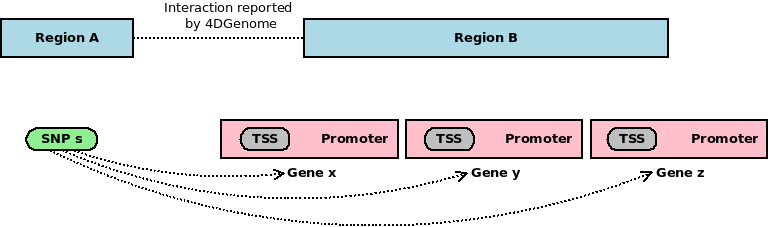

## 4DGenome Data

### Download

Website: [Downloads Page of 4DGenome Project](https://4dgenome.research.chop.edu/Download.html)

Dataset: Homo sapiens (hg19) [375M]

Download time: 2018-12-04 17:03:45

Filename: `4DGenome_HomoSapiens_hg19.txt`

### Supplementary File

See `4DG_Bioinformatics_Suppl_Revision.docx`, downloaded from [its published paper in _Bioinformatics_](https://academic.oup.com/bioinformatics/article/32/17/2727/2450752)

### Coordinate System

Since _4DGenome_ webtool supports region queries in _UCSC Genome Browser_ format (e.g. `chr1:10000-20000`), I **assume** it's using 0-based coordinate system accordingly.

Another evidence: if you query `chr1:1-1`, _4DGenome_ will report an error.

Our SNP locations are also 0-based, so no extra care is needed before matching.

## SNP-gene edges

As illustrated above, if a SNP and a TSS/promoter correspondingly reside in 2 regions that are proved interacted from 4DGenome data, we can draw an edge between the SNP and the gene whose TSS/promoter is invovled in the interaction. E.g. `s1`-`g1`, `s2`-`g2`, `s3`-`g3`, `s4`-`g4` in the above figure.

The relationship of residence will be tested by [`bedtools intersect` CLI](https://bedtools.readthedocs.io/en/latest/content/tools/intersect.html).

## SNP-SNP edges

Similarly, we can draw an edge between 2 SNPs if they reside in 2 interacted regions. 

Note that the SNP-SNP edges will be saved to another folder, `cerenkov3/cerenkov3_data/edge/snp-snp/Chromatin-Interaction/4DGenome`.