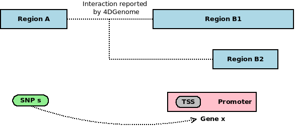

## 4DGenome Data

### Download

Website: [Downloads Page of 4DGenome Project](https://4dgenome.research.chop.edu/Download.html)

Dataset: Homo sapiens (hg19) [375M]

Download time: 2018-12-04 17:03:45

Filename: `4DGenome_HomoSapiens_hg19.txt`

### Supplementary File

See `4DG_Bioinformatics_Suppl_Revision.docx`, downloaded from [its published paper in _Bioinformatics_](https://academic.oup.com/bioinformatics/article/32/17/2727/2450752)

### Coordinate System

Since _4DGenome_ webtool supports region queries in _UCSC Genome Browser_ format (e.g. `chr1:10000-20000`), I **assume** it's using 0-based coordinate system accordingly.

Another evidence: if you query `chr1:1-1`, _4DGenome_ will report an error.

Our SNP locations are also 0-based, so no extra care is needed before matching.

## SNP-gene edges

As illustrated above, if a SNP and a TSS/promoter correspondingly reside in, or overlap with, 2 regions that are proved interacted from 4DGenome data, we can draw an edge between the SNP and the gene whose TSS/promoter is invovled in the interaction. E.g. `s`-`x`, `s`-`y` and `s`-`z` in the above figure.

The relationship of residence/overlap will be tested by [`bedtools intersect` CLI](https://bedtools.readthedocs.io/en/latest/content/tools/intersect.html).

### Possible SNP-gene edge exclusion based on pathway media

Based on our definition of promoters, if a gene's TSS resides in a 4DGenome region, certainly its promoter will overlap with that given region. Therefore there would be 2 weights, $w_{\text{TSS}}$ and $w_{\text{promoter}}$ for any snp-gene edge ending at this gene.

If you consider $w_{\text{promoter}}$ redundant for such edges in this case (thus change the interpretation of these weights), you may want to delete such weight directly. However, pay attension to the following scenario:

Note that in our application, we will output two $s$-$x$ intermediate edges, one in a SNP-TSS edge list, the other in a SNP-promoter one. (Then assign weights to those edge lists.) If you simply delete the $s$-$x$ in the SNP-promoter edge list, you will miss the promoter-overlapping association built through `Region A` to `Region B2`. The correct way is to delete the edges of the same pathway media. In the above scenario, the $s$-$x$ edges can be built through 3 pathways:

- `A`-TSS-`B1`
- `A`-Promoter-`B1`
- `A`-Promoter-`B2`

You can consider `A`-Promoter-`B1` pathway redundant in this scenario, but even with that pathway eliminated, you'll still have 2 $s$-$x$ edges (in 2 edge lists correspondingly). 

However, if there is no such `Region B2`, you'll end with only one $s$-$x$ edges (in the SNP-TSS edge list).

Note: we do not perform such elimination in our application for now but we may try in the future.

## SNP-SNP edges

Similarly, we can draw an edge between 2 SNPs if they reside in 2 interacted regions. 

Note that the SNP-SNP edges will be saved to another folder, `cerenkov3/cerenkov3_data/edge/snp-snp/Chromatin-Interaction/4DGenome`.