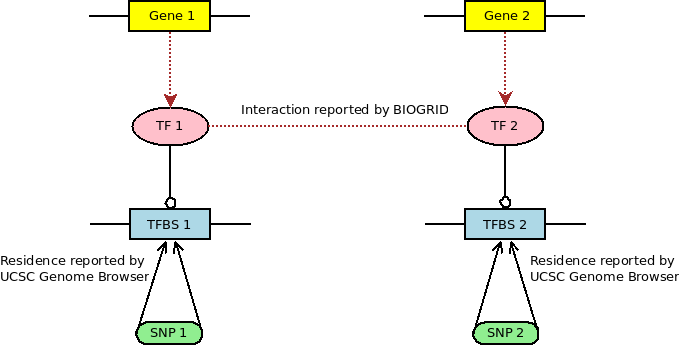

## BIOGRID Data

We will use BIOGRID version 3.5.171 here. The file to download is [BIOGRID-ALL-3.5.171.tab2.zip](https://downloads.thebiogrid.org/Download/BioGRID/Release-Archive/BIOGRID-3.5.171/BIOGRID-ALL-3.5.171.tab2.zip). Note that it's recommended to use the `tab2` file instead of the `tab` format.

BIOGRID reports interactions between TFs and essentially between genes. We can test if our SNPs reside in any TFBS throght USCS Genome Browser and then connect them to genes through TFs, as shown in the following diagram:



We can also connect SNPs to SNPs from this network.

## Issues with Unofficial Symbols

The TFBS symbols in tabel `wgEncodeRegTfbsClusteredV3` of UCSC Genome Browser are mostly official, with a few exceptions: `FAM48A`, `GRp20`, `KAP1`, `RDBP`, `RPC155`, `SIN3AK20` and `SREBP1`. We will update these 7 unofficial symbols as indicated below:

- Rename to new symbols that do not exist in the `wgEncodeRegTfbsClusteredV3`
    - `FAM48A` => `SUPT20H`; see https://www.ncbi.nlm.nih.gov/gene/55578
    - `RDBP` => `NELFE`; see https://www.ncbi.nlm.nih.gov/gene/7936
    - `RPC155` => `POLR3A`; see https://www.ncbi.nlm.nih.gov/gene/11128
    - `SREBP1` => `SREBF1`; see https://www.ncbi.nlm.nih.gov/gene/6720
- Merge with the existing symbols in `wgEncodeRegTfbsClusteredV3`
    - `KAP1` => `TRIM28`; see https://www.ncbi.nlm.nih.gov/gene/10155
    - `GRp20` => `NR3C1`; see https://www.ncbi.nlm.nih.gov/gene/2908
        - Because `GRp20` == `GR (P-20)`, we see `GRp20` as a special `GR` and `GR` is synonymous to `NR3C1`
    - `SIN3AK20` => `SIN3A`; see https://www.ncbi.nlm.nih.gov/gene/25942
        - Because `SIN3AK20` == `SIN3A (K-20)`

After updating, the new symbol set is a subset of the BIOGRID official symbols. In other word, we don't have to parse the BIOGRID alias columns to match the TFBS symbols.

The validity of the updating method can be proved by the following code.

```bash
ramseylab:~$ mysql --user=genome --host=genome-mysql.soe.ucsc.edu -A -P 3306

mysql> use hg19;
Database changed
mysql> select distinct tf.name from wgEncodeRegTfbsClusteredV3 as tf;
161 rows in set
```

```python
In [1]: ucsc_symbols = {"ZBTB33", "CEBPB", "CTCF", "TAF1", "GABPA", "USF1", "SP1", "EGR1", "FOXA1", "RUNX3", "MAZ", "RAD21", "SMC3", "MAFF", "MAFK", "BHLHE40", "FOSL2", "JUND", "E2F6", "MAX", "POLR2A", "PAX5", "PHF8", "PML", "YY1", "SIN3AK20", "E2F1", "GTF2F1", "ATF2", "KDM5A", "MYC", "MXI1", "POU2F2", "KDM5B", "TBP", "IRF1", "EP300", "TAF7", "ELK1", "RFX5", "TCF7L2", "CHD2", "FOXP2", "ATF3", "BRCA1", "NFYA", "RELA", "NFYB", "GRp20", "REST", "JUN", "E2F4", "SRF", "ELF1", "CREB1", "ATF1", "SIX5", "USF2", "FOS", "TBL1XR1", "ZNF143", "SP2", "EBF1", "CTCFL", "TEAD4", "THAP1", "ZEB1", "ZNF263", "PBX3", "UBTF", "CBX3", "BCLAF1", "NR2C2", "RBBP5", "GATA1", "RCOR1", "FOSL1", "GATA2", "TAL1", "GATA3", "TCF12", "BCL3", "NFATC1", "MEF2A", "MEF2C", "CCNT2", "BACH1", "HDAC2", "TCF3", "ZNF274", "STAT1", "BATF", "SPI1", "HMGN3", "SETDB1", "ETS1", "ZBTB7A", "EZH2", "JUNB", "SP4", "TFAP2A", "TFAP2C", "NR2F2", "ESR1", "SIN3A", "TRIM28", "HNF4G", "RXRA", "GTF3C2", "SUZ12", "CTBP2", "NR3C1", "SAP30", "CHD1", "KAP1", "NANOG", "STAT5A", "HDAC1", "ELK4", "NRF1", "STAT3", "HNF4A", "FOXA2", "SMARCC1", "SMARCB1", "ESRRA", "STAT2", "MYBL2", "NFIC", "SREBP1", "ARID3A", "CEBPD", "IRF4", "BCL11A", "MTA3", "FOXM1", "ZNF217", "HSF1", "HDAC8", "NFE2", "IRF3", "WRNIP1", "GTF2B", "HDAC6", "SMARCA4", "ZKSCAN1", "BRF2", "IKZF1", "POU5F1", "RPC155", "PPARGC1A", "BDP1", "SIRT6", "SMARCC2", "MBD4", "PRDM1", "FAM48A", "RDBP", "ZZZ3", "POLR3G", "BRF1"}  # There are only 161 distinct TFBS names in wgEncodeRegTfbsClusteredV3

In [2]: {"SUPT20H", "NELFE", "POLR3A", "SREBF1"} & ucsc_symbols  # These 4 symbols do not exist in the UCSC Genome Browser table
Out[2]: set()

In [3]: {"TRIM28", "NR3C1", "SIN3A"} < ucsc_symbols  # These 3 exist
Out[3]: True

In [4]: import pandas as pd

In [5]: biogrid_df = pd.read_csv("./edge/snp-gene/TFBS/BioGRID/BIOGRID-Human-3.5.171.tab2.tsv", sep="\t", usecols=[2,3])

In [6]: biogrid_symbols = set(biogrid_df.loc[:, "Official Symbol Interactor A"]) | set(biogrid_df.loc[:, "Official Symbol Interactor B"])

In [7]: ucsc_symbols - biogrid_symbols
Out[7]: {'FAM48A', 'GRp20', 'KAP1', 'RDBP', 'RPC155', 'SIN3AK20', 'SREBP1'}

In [8]: updated_ucsc_symbols = (ucsc_symbols - {'FAM48A', 'GRp20', 'KAP1', 'RDBP', 'RPC155', 'SIN3AK20', 'SREBP1'}) | {"SUPT20H", "NELFE", "POLR3A", "SREBF1", "TRIM28", "NR3C1", "SIN3A"}  # updating the UCSC symbols

In [9]: updated_ucsc_symbols < biogrid_symbols  # now the updated UCSC symbols are a subset of the BIOGRID symbols
Out[9]: True
```