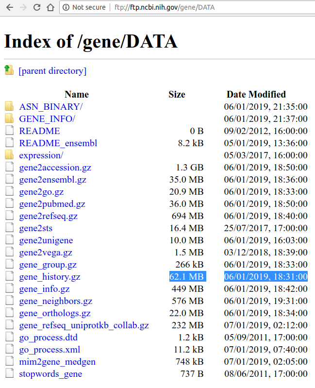

## Aim

When querying Entrez Gene IDs from Ensembl Gene IDs through Biomart, discontinued Entrez Gene IDs may be returned. 

E.g. [ENSG00000072682.14](http://grch37.ensembl.org/biomart/martview/478584448b99736778dcf300ae0fd0e3?VIRTUALSCHEMANAME=default&ATTRIBUTES=hsapiens_gene_ensembl.default.feature_page.ensembl_gene_id|hsapiens_gene_ensembl.default.feature_page.start_position|hsapiens_gene_ensembl.default.feature_page.end_position|hsapiens_gene_ensembl.default.feature_page.external_gene_name|hsapiens_gene_ensembl.default.feature_page.entrezgene&FILTERS=hsapiens_gene_ensembl.default.filters.ensembl_gene_id_version."ENSG00000072682.14"|hsapiens_gene_ensembl.default.filters.chromosome_name."1,2,3,4,5,6,7,8,9,10,11,12,13,14,15,16,17,18,19,20,21,22,X,Y"&VISIBLEPANEL=resultspanel)

| Gene stable ID  | Gene start (bp) | Gene end (bp) | Gene name | EntrezGene ID | 
|-----------------|-----------------|---------------|-----------|---------------| 
| ENSG00000072682 | 131527531       | 131631008     | P4HA2     | 101927705     | 
| ENSG00000072682 | 131527531       | 131631008     | P4HA2     | 8974          | 

where [101927705 is actually discontinued](https://www.ncbi.nlm.nih.gov/gene/?term=101927705).

To remove such discontinued Entrez Gene IDs, following [Biostars - Question: Remove/Identify deprecated IDs from a list of Entrez IDs programatically](https://www.biostars.org/p/151574/#151690), we download [ftp://ftp.ncbi.nih.gov/gene/DATA/gene_history.gz](ftp://ftp.ncbi.nih.gov/gene/DATA/gene_history.gz) to provide a list of such IDs.

