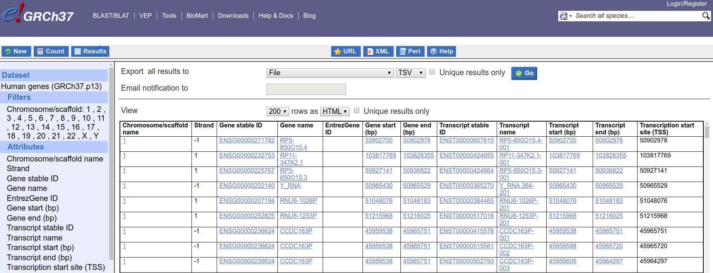

## 1. Ensembl Genes

We used BioMart of the Ensembl project to fetch the gene IDs and coordinates. Because we used GRCh37 coordinates for our SNPs, we stick to GRCh37 archive of Ensembl here.

- [GRCh37 dedicated site](http://grch37.ensembl.org/index.html)

> As from August 2014 we are supporting the human GRCh37 assembly at our dedicated GRCh37 human site. Unlike the other Ensembl archive sites, this will be updated to the latest web interface every Ensembl release and there may be occasional data updates to human.

### 1.1 Query

- [BioMart Page](http://grch37.ensembl.org/biomart/martview/ab5aa16c0090f93c4a06be76fd30ed9e?VIRTUALSCHEMANAME=default&ATTRIBUTES=hsapiens_gene_ensembl.default.feature_page.chromosome_name|hsapiens_gene_ensembl.default.feature_page.strand|hsapiens_gene_ensembl.default.feature_page.ensembl_gene_id|hsapiens_gene_ensembl.default.feature_page.external_gene_name|hsapiens_gene_ensembl.default.feature_page.entrezgene|hsapiens_gene_ensembl.default.feature_page.start_position|hsapiens_gene_ensembl.default.feature_page.end_position|hsapiens_gene_ensembl.default.feature_page.ensembl_transcript_id|hsapiens_gene_ensembl.default.feature_page.external_transcript_name|hsapiens_gene_ensembl.default.feature_page.transcript_start|hsapiens_gene_ensembl.default.feature_page.transcript_end|hsapiens_gene_ensembl.default.feature_page.transcription_start_site&FILTERS=hsapiens_gene_ensembl.default.filters.chromosome_name."1,2,3,4,5,6,7,8,9,10,11,12,13,14,15,16,17,18,19,20,21,22,X,Y"&VISIBLEPANEL=resultspanel)
- Query criteria:
    - Dataset: Human genes (GRCh37.p13)
    - Filters:
        - Chromosome/scaffold: 1 , 2 , 3 , 4 , 5 , 6 , 7 , 8 , 9 , 10 , 11 , 12 , 13 , 14 , 15 , 16 , 17 , 18 , 19 , 20 , 21 , 22 , X , Y
    - Attributes:
        - Chromosome/scaffold name
        - Strand
        - Gene stable ID
        - Gene name
        - EntrezGene ID
        - Gene start (bp)
        - Gene end (bp)
        - Transcript stable ID
        - Transcript name
        - Transcript start (bp)
        - Transcript end (bp)
        - Transcription start site (TSS)
	


### 1.2 Download

We will use the wget+xml method to download the results. See:

- [BioMart RESTful access (Perl and wget)](https://grch37.ensembl.org/info/data/biomart/biomart_restful.html#wget)
- [BioMart 0.9.0 User Manual](http://www.biomart.org/other/biomart_0.9_0_documentation.pdf)
    - P83, Section 12.3.4. Querying

```xml
<?xml version="1.0" encoding="UTF-8"?>
<!DOCTYPE Query>
<Query  virtualSchemaName = "default" formatter = "TSV" header = "1" uniqueRows = "0" count = "" datasetConfigVersion = "0.6" >
			
	<Dataset name = "hsapiens_gene_ensembl" interface = "default" >
		<Filter name = "chromosome_name" value = "1,2,3,4,5,6,7,8,9,10,11,12,13,14,15,16,17,18,19,20,21,22,X,Y"/>
		<Attribute name = "chromosome_name" />
		<Attribute name = "transcript_start" />
		<Attribute name = "transcript_end" />
		<Attribute name = "transcription_start_site" />
		<Attribute name = "strand" />
		<Attribute name = "ensembl_gene_id" />
		<Attribute name = "external_gene_name" />
		<Attribute name = "entrezgene" />
		<Attribute name = "start_position" />
		<Attribute name = "end_position" />
		<Attribute name = "ensembl_transcript_id" />
		<Attribute name = "external_transcript_name" />
	</Dataset>
</Query>
```

- [URL for the query results](http://grch37.ensembl.org/biomart/martservice/results?query=%3C?xml%20version=%221.0%22%20encoding=%22UTF-8%22?%3E%3C!DOCTYPE%20Query%3E%3CQuery%20virtualSchemaName=%22default%22%20formatter=%22TSV%22%20header=%221%22%20uniqueRows=%220%22%20count=%22%22%20datasetConfigVersion=%220.6%22%3E%3CDataset%20name=%22hsapiens_gene_ensembl%22%20interface=%22default%22%3E%3CFilter%20name=%22chromosome_name%22%20value=%221,2,3,4,5,6,7,8,9,10,11,12,13,14,15,16,17,18,19,20,21,22,X,Y%22/%3E%3CAttribute%20name=%22chromosome_name%22/%3E%3CAttribute%20name=%22transcript_start%22/%3E%3CAttribute%20name=%22transcript_end%22/%3E%3CAttribute%20name=%22transcription_start_site%22/%3E%3CAttribute%20name=%22strand%22/%3E%3CAttribute%20name=%22ensembl_gene_id%22/%3E%3CAttribute%20name=%22external_gene_name%22/%3E%3CAttribute%20name=%22entrezgene%22/%3E%3CAttribute%20name=%22start_position%22/%3E%3CAttribute%20name=%22end_position%22/%3E%3CAttribute%20name=%22ensembl_transcript_id%22/%3E%3CAttribute%20name=%22external_transcript_name%22/%3E%3C/Dataset%3E%3C/Query%3E)
- wget command: `wget -O mart_export.txt 'http://grch37.ensembl.org/biomart/martservice/results?query=<?xml version="1.0" encoding="UTF-8"?><!DOCTYPE Query><Query  virtualSchemaName="default" formatter="TSV" header="1" uniqueRows="0" count="" datasetConfigVersion="0.6"><Dataset name="hsapiens_gene_ensembl" interface="default"><Filter name="chromosome_name" value="1,2,3,4,5,6,7,8,9,10,11,12,13,14,15,16,17,18,19,20,21,22,X,Y"/><Attribute name="chromosome_name"/><Attribute name="transcript_start"/><Attribute name="transcript_end"/><Attribute name="transcription_start_site"/><Attribute name="strand"/><Attribute name="ensembl_gene_id"/><Attribute name="external_gene_name"/><Attribute name="entrezgene"/><Attribute name="start_position"/><Attribute name="end_position"/><Attribute name="ensembl_transcript_id"/><Attribute name="external_transcript_name"/></Dataset></Query>'`
- Filename: `mart_export.txt` (TSV format)

### 1.3 Notes on the downloaded file

#### 1.3.1 Coordinate System

[Ensembl FAQ](https://uswest.ensembl.org/Help/Faq?id=286):

> Ensembl uses a one-based coordinate system, whereas UCSC uses a zero-based coordinate system.

#### 1.3.2 TSS

- If `strand == 1`, TSS == Transcript start; else
- if `strand == -1`, TSS == Transcript end

#### 1.3.3 Start-end Ranges

A gene's `[start, end]` range is not always the same with its transcript's. You can check with the following code:

```r
library(dplyr)
library(readr)
library(magrittr)

ensembl_gene_df <- read_tsv("mart_export.txt", col_types=cols(
	`Gene stable ID` = col_character(),
	`Gene name` = col_character(),
	Strand = col_integer(),
	`Chromosome/scaffold name` = col_character(),
	`Transcription start site (TSS)` = col_integer(),
	`Transcript start (bp)` = col_integer(),
	`Transcript end (bp)` = col_integer(),
	`Gene start (bp)` = col_integer(),
	`Gene end (bp)` = col_integer()
))

ensembl_gene_df <- ensembl_gene_df %>% rename(
	gene_id = `Gene stable ID`,
	gene_name = `Gene name`,
	strand = Strand,
	chromosome = `Chromosome/scaffold name`,
	TSS = `Transcription start site (TSS)`,
	transcript_start = `Transcript start (bp)`,
	transcript_end = `Transcript end (bp)`,
	gene_start = `Gene start (bp)`,
	gene_end = `Gene end (bp)`
)

# Check if exceeded a integer's range
# Otherwise use `col_double()` when reading the TSV
stopifnot(ensembl_gene_df$transcript_start %>% max < .Machine$integer.max)
stopifnot(ensembl_gene_df$transcript_end %>% max < .Machine$integer.max)
stopifnot(ensembl_gene_df$gene_start %>% max < .Machine$integer.max)
stopifnot(ensembl_gene_df$gene_end %>% max < .Machine$integer.max)

ensembl_gene_df %>% filter(.$transcript_start != .$gene_start)
ensembl_gene_df %>% filter(.$transcript_end != .$gene_end)
```

## 2. Data Processing

We have 2 R scripts here:

1. `p1_preprocess.R`, aiming to
    1. rename the columns of `mart_export.txt`
    2. since Ensembl uses 1-based coordinate system while we use 0-based, revise `TSS`, `gene_start` and `transcript_start` columns
    3. add "chr" prefix to "chromosome" column, e.g. "1" => "chr1"
    4. save the revised dataframe to a TSV file, `p1_ensembl_gene_df.tsv`
1. `p2_make_BED.R`, aiming to
    1. use `p1_ensembl_gene_df.tsv` as input
    2. save "chromosome", "promoter_start", "promoter_end", "gene_name", "ensembl_gene_id", "entrez_gene_id" and "strand" to a BED file, `ensembl_gene_promoter.bed`
        - You always have `transcript_start < transcript_end`, `gene_start < gene_end` and `TSS_start + 1 == TSS_end`
        - If strand == +1, define:
            - promoter_start = TSS_start - 2000, and 
            - promoter_end = TSS_end + 500 (smaller coordinates mean upstream)
        - If strand == -1, define:
            - promoter_start = TSS_start - 500, and 
            - promoter_end = TSS_end + 2000 (bigger coordinates mean upstream)
    3. save "chromosome", "TSS_start", "TSS_end", "gene_name", "ensembl_gene_id", "entrez_gene_id" and "strand" to a BED file, `ensembl_gene_TSS.bed`
    4. Note: BED format is not strictly followed here.

Further we want to draw edges between SNPs and genes (through its TSS/promoter). If a SNP resides in `region_A` and a TSS/promoter in `region_B` and these 2 regions are proved interacted (e.g. from 4DGenome data), we can draw an edge between the SNP and the gene whose TSS/promoter is invovled in the interaction.

The residence tests will be done with [`bedtools intersect` CLI](https://bedtools.readthedocs.io/en/latest/content/tools/intersect.html) and that's why we make BED files here